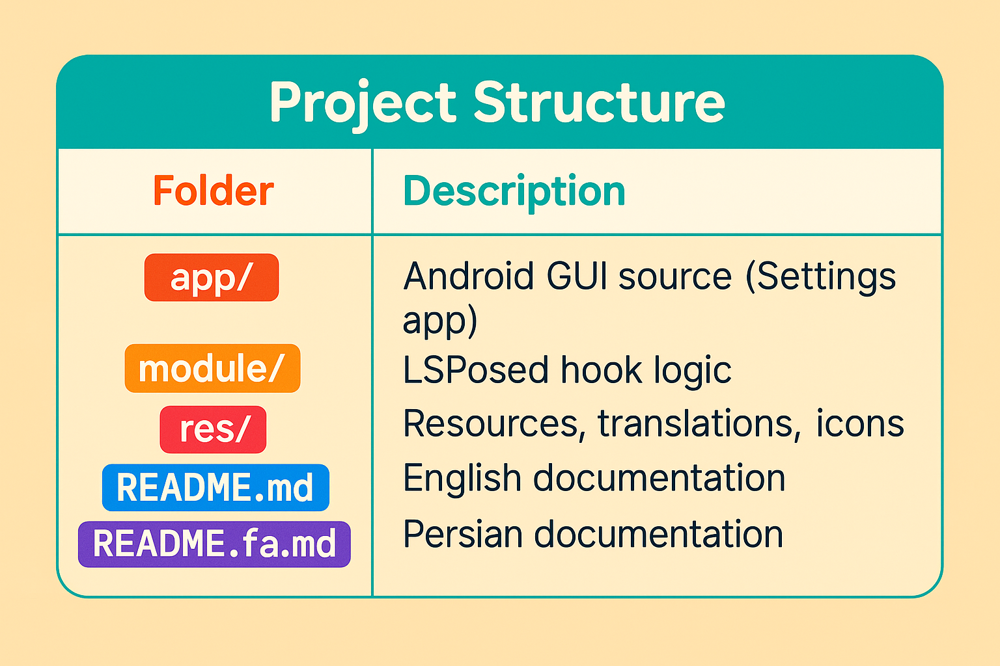

# 🚀 PowerGram-Lsposed

A powerful LSPosed module designed to enhance the **official Telegram** app with **privacy**, **performance**, and **premium unlocking** features.

> ⚠️ Supports only the **Google Play version** of Telegram for best stability and integration.

---

##  Features

###  Privacy Control
- Hide “Seen” status in private chats
- Hide “Seen” in groups and channels
- Hide “Story Viewed” status
- Hide “Online” presence
- Hide phone number
- Disable Story feature
- Hide typing indicator
- View deleted messages
- Prevent self-deleting media

### 🔓 Premium Unlock
- Access all locked content in channels
- Save videos freely to gallery
- Unlock **Telegram Premium** features:
  - Premium emoji access
  - Faster downloads
  - Unlimited pinned chats
  - Instant message translation
  - Ad-free experience
  - Exclusive reactions

### ⚙️ GUI Settings Panel
- Launcher icon access
- Intuitive GUI in **English + Persian**
- Checkbox-based configuration
- Built-in settings shortcut (gear icon) in LSPosed

### 🚀 Performance Boost
- Disable unnecessary animations
- Optimize startup time
- Reduce log creation
- Hook only when necessary
- Improve scroll fluidity

### 🔔 Smart Notification Filtering
- Filter messages via keywords
- Silence specific messages
- Apply filters per chat or message type

---

## 📦 Requirements
- ✅ LSPosed framework installed
- ✅ Official Telegram (Play Store)
- ✅ Android 8+

---

## 🌐 Languages
- 🇺🇸 English
- 🇮🇷 فارسی

---

## 🗂 Project Structure

| Folder        | Description                          |
|---------------|--------------------------------------|
| `app/`        | Android GUI source (Settings app)    |
| `module/`     | LSPosed hook logic                   |
| `res/`        | Resources, translations, icons       |
| `README.md`   | English documentation                |
| `README.fa.md`| Persian documentation                |

---

> 🛠️ **This project is open-source and intended for educational purposes.**  
> **Not affiliated with Telegram or LSPosed.**

---

## 🔗 Related Links
- [📄 Persian🇮🇷 README](./README.fa.md)
- [📦 Telegram Source Code](https://github.com/DrKLO/Telegram)
- [🔧 LSPosed Framework](https://github.com/LSPosed/LSPosed)

